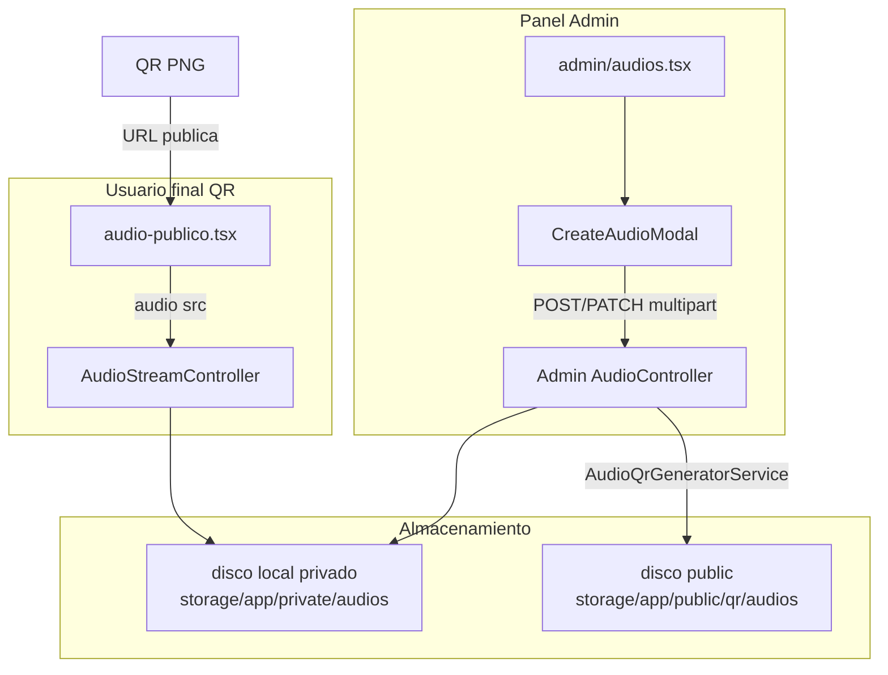

# Plan: Módulo de Audios (Admin + Página pública)

## Contexto del proyecto

El proyecto no tiene código de audios hoy. Los patrones a seguir están en:

- CRUD admin: [`app/Http/Controllers/Admin/HistoriaController.php`](app/Http/Controllers/Admin/HistoriaController.php) y [`app/Http/Controllers/Admin/ProductoController.php`](app/Http/Controllers/Admin/ProductoController.php)
- Policies: [`app/Policies/Concerns/GrantsAllAbilitiesToAdmins.php`](app/Policies/Concerns/GrantsAllAbilitiesToAdmins.php) + registro en [`app/Providers/AppServiceProvider.php`](app/Providers/AppServiceProvider.php)
- Página pública: [`resources/js/pages/user/detalles-historia.tsx`](resources/js/pages/user/detalles-historia.tsx) con `ClienteLayout` y serializador [`app/Support/HistoriaCatalogoSerializer.php`](app/Support/HistoriaCatalogoSerializer.php)
- Nav admin: [`resources/js/config/panel-nav.ts`](resources/js/config/panel-nav.ts)
- Rutas admin: grupo `can:admin` en [`routes/web.php`](routes/web.php) (líneas 121–173)

**Diferencia clave vs video de historias:** los videos actuales van a disco `public` con URL directa `/storage/...`. Los audios deben ir a disco **privado** y servirse por endpoint de streaming para cumplir el requisito de no exponer descarga directa.

## Arquitectura



## Decisiones de diseño

| Tema | Decisión |
|------|----------|
| Relación | `audio` belongsTo `historia`; varios audios por historia permitidos |
| URL pública | `/audios/{slug}` — binding por `slug` único (`Str::slug(titulo)-random`) |
| Stream | `/audios/{slug}/stream` — `Content-Disposition: inline`, soporte Range (206) |
| Audio en disco | `storage/app/private/audios/{id}/` (disco `local` existente en [`config/filesystems.php`](config/filesystems.php)) |
| QR PNG | `storage/app/public/qr/audios/{slug}.png` — descargable desde admin |
| Logo HC | Path configurable en `config/media.php` → clave `audio.qr_logo_path` (usuario indicará asset propio en implementación) |
| Tamaño máximo | **50 MB** — validación Laravel + constante en `config/media.php` |
| Formatos | `audio/mpeg`, `audio/mp4`, `audio/x-m4a`, `audio/wav`, `audio/ogg` |
| Estado | `activo` / `pausado` — página pública y stream solo si `activo` |
| Dependencia nueva | `composer require endroid/qr-code` (generación QR + logo centrado) |

## 1. Backend — datos y dominio

### Migración `audios`

Crear con `php artisan make:model Audio -mf`:

- `historia_id` (FK `historias`, cascade on delete)
- `titulo` (string)
- `slug` (string, unique) — token público
- `codigo` (string, unique, nullable) — código interno opcional
- `audio_path` (string) — path relativo en disco privado
- `qr_path` (string, nullable) — URL pública `/storage/qr/audios/...`
- `duracion_segundos`, `tamano_bytes`, `mime_type` (nullable)
- `estado` enum `activo|pausado`, default `activo`
- `timestamps`, `softDeletes` (alineado con [`app/Models/Historia.php`](app/Models/Historia.php))

### Modelo [`app/Models/Audio.php`](app/Models/Audio.php)

- `belongsTo(Historia::class)`
- Scope `adminFilters(Request)` — búsqueda por `titulo`, `codigo`, nombre de historia
- Scope `activos()`
- Route key: `slug`

Añadir en `Historia`: `hasMany(Audio::class)`.

### Config [`config/media.php`](config/media.php)

Nueva sección `audio`:

```php
'audio' => [
    'max_upload_kb' => 51200,
    'allowed_mimetypes' => ['audio/mpeg', 'audio/mp4', 'audio/x-m4a', 'audio/wav', 'audio/ogg'],
    'qr_logo_path' => public_path('images/logo-hc.png'), // ajustar al asset real del usuario
    'qr_size' => 512,
],
```

### Servicios

| Servicio | Responsabilidad |
|----------|-----------------|
| [`app/Services/Audio/AudioStorageService.php`](app/Services/Audio/AudioStorageService.php) | `store()`, `delete()`, `stream()` con Range; guardar en disco `local` bajo `audios/{id}/` |
| [`app/Services/Audio/AudioQrGeneratorService.php`](app/Services/Audio/AudioQrGeneratorService.php) | Generar QR con `endroid/qr-code` apuntando a `route('audios.show', $slug)`; superponer logo desde config; guardar PNG en disco `public` |

### Serializer

[`app/Support/AudioPublicSerializer.php`](app/Support/AudioPublicSerializer.php) — props para página pública:

```php
[
    'titulo' => ...,
    'stream_url' => route('audios.stream', $audio),
    'historia' => [
        'nombre' => $historia->nombre,
        'imagen' => $historia->imagen ?: '/images/story_cover.png',
        'descripcion_corta' => $historia->descripcion_corta,
    ],
]
```

## 2. Backend — HTTP

### Form Requests

- [`app/Http/Requests/Admin/StoreAudioRequest.php`](app/Http/Requests/Admin/StoreAudioRequest.php)
- [`app/Http/Requests/Admin/UpdateAudioRequest.php`](app/Http/Requests/Admin/UpdateAudioRequest.php)

Patrón: `authorize(): true`, `messages()` en español, trait `FlashesValidationError` si aplica.

### Controllers

**[`app/Http/Controllers/Admin/AudioController.php`](app/Http/Controllers/Admin/AudioController.php)**

| Método | Acción |
|--------|--------|
| `index` | Listado paginado (10), filtros, historias para select, `Inertia::render('admin/audios')` |
| `store` | Transaction: crear Audio → guardar archivo → generar QR → flash success |
| `update` | Actualizar campos; reemplazar audio si viene archivo; regenerar QR si cambia slug |
| `destroy` | Borrar audio privado + QR + soft delete |
| `downloadQr` | Response PNG attachment `qr-{slug}.png` |

**[`app/Http/Controllers/Storefront/AudioPublicController.php`](app/Http/Controllers/Storefront/AudioPublicController.php)**

- `show(Audio $audio)` — solo `activo`, eager load `historia`, render `user/audio-publico`

**[`app/Http/Controllers/Storefront/AudioStreamController.php`](app/Http/Controllers/Storefront/AudioStreamController.php)**

- `stream(Audio $audio)` — validar activo, delegar a `AudioStorageService::streamResponse()`
- Headers: `Content-Type`, `Content-Disposition: inline`, `Accept-Ranges: bytes`
- Throttle: `throttle:60,1` en ruta

### Policy y registro

- [`app/Policies/AudioPolicy.php`](app/Policies/AudioPolicy.php) — solo trait `GrantsAllAbilitiesToAdmins`
- Registrar en `AppServiceProvider`: `Gate::policy(Audio::class, AudioPolicy::class)`

### Rutas en [`routes/web.php`](routes/web.php)

**Públicas** (fuera de auth, junto a `historias.show`):

```php
Route::get('/audios/{audio:slug}', [AudioPublicController::class, 'show'])->name('audios.show');
Route::get('/audios/{audio:slug}/stream', [AudioStreamController::class, 'stream'])
    ->middleware('throttle:60,1')
    ->name('audios.stream');
```

**Admin** (dentro del grupo `can:admin`):

```php
Route::get('audios', ...)->name('audios');
Route::post('audios', ...)->name('audios.store');
Route::patch('audios/{audio}', ...)->name('audios.update');
Route::delete('audios/{audio}', ...)->name('audios.destroy');
Route::get('audios/{audio}/qr', ...)->name('audios.qr');
```

Tras rutas: `php artisan wayfinder:generate`.

### Middleware Inertia

Añadir `audios.show` a `isPublicStorefrontRoute()` en [`app/Http/Middleware/HandleInertiaRequests.php`](app/Http/Middleware/HandleInertiaRequests.php) si la página pública necesita props lazy de tienda (PayPal no aplica, pero mantiene consistencia de layout).

## 3. Frontend — Panel admin

### Página [`resources/js/pages/admin/audios.tsx`](resources/js/pages/admin/audios.tsx)

Basada en [`resources/js/pages/admin/stories.tsx`](resources/js/pages/admin/stories.tsx):

- `UserLayout` + `Head title="Audios"`
- Tabla: título, historia, estado, fecha, acciones (ellipsis)
- Filtro búsqueda + paginación `ListPagination` variant `admin`
- Botón "Crear audio"
- Acciones: Editar, Ver URL pública (`window.open`), Descargar QR (link a `admin.audios.qr`), Eliminar con `ConfirmDialog`
- Props: `audios: PaginatedData`, `historias: { id, nombre }[]`

### Modal [`resources/js/components/admin/CreateAudioModal.tsx`](resources/js/components/admin/CreateAudioModal.tsx)

Patrón de [`CreateStoryModal.tsx`](resources/js/components/admin/CreateStoryModal.tsx) (campo multimedia único):

- Select historia (required)
- Título, código opcional, estado
- Input file audio con validación cliente (MIME + 50 MB) en [`resources/js/components/admin/constants/media-limits.ts`](resources/js/components/admin/constants/media-limits.ts)
- `useForm` + `forceFormData: true`
- Edición: `audioToEdit` desde props (sin fetch JSON, como historias)
- Preview QR en edición (img desde `qr_path`)
- Rutas Wayfinder: `@/routes/admin/audios`

### Navegación

En [`resources/js/config/panel-nav.ts`](resources/js/config/panel-nav.ts):

- Importar `audios` desde `@/routes/admin`
- Nuevo icono en [`resources/js/components/panel/panel-nav-icons.tsx`](resources/js/components/panel/panel-nav-icons.tsx) (SVG coherente con panel-nav existente)
- Ítem "Audios" después de "Historias"

## 4. Frontend — Página pública

### [`resources/js/pages/user/audio-publico.tsx`](resources/js/pages/user/audio-publico.tsx)

- Layout: `ClienteLayout` (como detalles-historia)
- Hero: imagen historia + nombre + título audio + descripción corta
- Reproductor:

```tsx
<audio
  controls
  controlsList="nodownload noplaybackrate"
  playsInline
  preload="metadata"
  src={audio.stream_url}
/>
```

- Sin enlaces `<a download>` ni `src` apuntando a `/storage/`
- CSS: `select-none` en contenedor; mensaje si navegador no soporta reproducción

## 5. Seguridad (mitigación descarga)

No es posible bloquear descarga al 100% en web, pero se mitiga con:

1. Archivo en disco **privado** (no symlink público)
2. Stream solo vía controller con `inline` (no attachment)
3. UI sin botón descarga + `controlsList="nodownload"`
4. Throttle en endpoint stream
5. Audio inactivo → 404 en página y stream

## 6. Tests (Pest)

| Archivo | Casos |
|---------|-------|
| [`tests/Feature/Admin/AudioCrudTest.php`](tests/Feature/Admin/AudioCrudTest.php) | create con `UploadedFile::fake()`, validación historia/MIME, listado `assertInertia`, update, delete limpia storage |
| [`tests/Feature/Admin/AudioQrTest.php`](tests/Feature/Admin/AudioQrTest.php) | QR generado al crear, descarga PNG 200 |
| [`tests/Feature/Storefront/AudioPublicTest.php`](tests/Feature/Storefront/AudioPublicTest.php) | página 200 activo, 404 pausado, stream inline, no path `/storage/audios` en HTML |
| [`tests/Unit/Policies/AdminResourcePoliciesTest.php`](tests/Unit/Policies/AdminResourcePoliciesTest.php) | añadir caso `AudioPolicy` |

Usar `Storage::fake('local')` y `Storage::fake('public')` en tests.

Comando verificación:

```bash
php artisan test --compact --filter=Audio
vendor/bin/pint --dirty --format agent
npm run types:check
```

## 7. Orden de implementación


## Criterios de aceptación

- CRUD completo en `/admin/audios`
- Audio asociado a historia existente
- QR con logo HC y URL pública correcta; descarga PNG desde admin
- Página `/audios/{slug}` con imagen, nombre historia, título y reproductor
- Reproducción vía `/audios/{slug}/stream`, no URL directa al archivo privado
- Tests Pest pasan; build TS sin errores

## Fuera de alcance v1

- Analytics de reproducciones
- Múltiples idiomas / subtítulos
- Transcodificación FFmpeg del audio (almacenamiento directo del archivo subido)
- DRM avanzado

## Nota sobre logo HC

El usuario indicó un asset propio (opción "Other"). Durante la implementación, confirmar la ruta exacta del PNG/SVG y fijarla en `config/media.php` → `audio.qr_logo_path` antes de generar QRs en producción.
