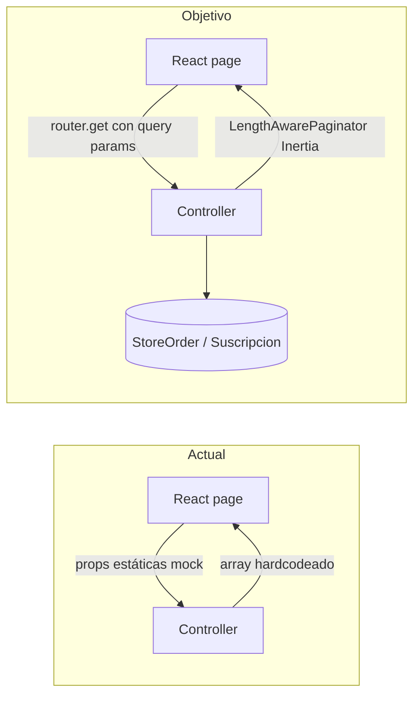

# Diseño Técnico: Panel del Usuario Suscriptor

## Visión General

El Panel del Usuario Suscriptor es una interfaz personal construida sobre el stack existente (Laravel 12 + Inertia.js v2 + React 19 + Tailwind CSS v4). El diseño React de todas las páginas ya está construido y funcional. Este documento describe exclusivamente los cambios necesarios para conectar el backend con datos reales: reemplazar mocks en tres controladores, migrar la paginación de client-side a server-side, agregar el endpoint de cancelación de suscripción, y conectar el flujo real de métodos de pago.

No se crean nuevos layouts, rutas de autenticación ni modelos de usuario. El trabajo es quirúrgico: modificar métodos existentes y agregar uno nuevo.

---

## Arquitectura

### Flujo de datos actual vs. objetivo



### Estrategia de paginación

Se migra de paginación client-side (array completo en props + slice en React) a paginación server-side (Laravel `paginate(10)` + `router.get()` de Inertia con query params `page`, `search`, `start_date`, `end_date`).

El frontend elimina los estados locales de filtrado y paginación. Cada cambio de filtro o página dispara un `router.get()` que preserva todos los query params activos.

### Estructura de rutas afectadas

```
GET  /orders                          → User\OrdenController@index
GET  /subscriptions                   → User\SuscripcionController@index
PATCH /subscriptions/{suscripcion}/cancel → User\SuscripcionController@cancel  ← NUEVA
GET  /profile                         → User\ProfileController@index
POST /profile/avatar                  → User\ProfileController@updateAvatar
POST /profile/payment-methods         → User\ProfileController@storePaymentMethod
```

---

## Componentes e Interfaces

### Backend — Controladores modificados

#### `User\OrdenController::index()`

Reemplaza el array mock con una consulta Eloquent real:

```php
public function index(Request $request): Response
{
    $query = StoreOrder::with('items')
        ->where('user_id', auth()->id())
        ->latest();

    if ($request->filled('search')) {
        $search = $request->search;
        $query->where(function ($q) use ($search) {
            $q->where('id', 'like', "%{$search}%")
              ->orWhereHas('items', fn($i) => $i->where('product_name', 'like', "%{$search}%"));
        });
    }

    if ($request->filled('start_date')) {
        $query->whereDate('created_at', '>=', $request->start_date);
    }

    if ($request->filled('end_date')) {
        $query->whereDate('created_at', '<=', $request->end_date);
    }

    $ordenes = $query->paginate(10)->through(fn($order) => [
        'id'          => '#' . $order->id,
        'fecha'       => $order->created_at->toDateString(),
        'producto'    => $order->items->first()?->product_name ?? '—',
        'imagen'      => '/images/products/product-1.png', // placeholder hasta que exista imagen en item
        'precio'      => '$' . number_format($order->total, 2),
        'cantidad'    => $order->items->sum('quantity'),
        'estado'      => match($order->status) {
            'paid'            => 'Completado',
            'capture_failed'  => 'Rechazado',
            'pending_payment' => 'Pendiente',
            default           => $order->status,
        },
        'estado_color' => match($order->status) {
            'paid'            => 'success',
            'capture_failed'  => 'danger',
            'pending_payment' => 'warning',
            default           => 'warning',
        },
    ]);

    return Inertia::render('user/orders', [
        'ordenes' => $ordenes,
        'filters' => $request->only(['search', 'start_date', 'end_date']),
    ]);
}
```

#### `User\SuscripcionController::index()`

Mientras el modelo `Suscripcion` no exista, retorna un paginador vacío compatible con la estructura esperada por el frontend. Cuando el modelo exista (creado por el spec del admin-panel), se reemplaza con la consulta real:

```php
public function index(Request $request): Response
{
    // Fase 1: modelo Suscripcion aún no existe → paginador vacío
    $suscripciones = new \Illuminate\Pagination\LengthAwarePaginator(
        [], 0, 10, 1, ['path' => $request->url()]
    );

    // Fase 2 (cuando exista el modelo):
    // $query = Suscripcion::where('user_id', auth()->id())->latest();
    // if ($request->filled('search')) { ... }
    // if ($request->filled('start_date')) { ... }
    // if ($request->filled('end_date')) { ... }
    // $suscripciones = $query->paginate(10);

    return Inertia::render('user/subscriptions', [
        'suscripciones' => $suscripciones,
        'filters'       => $request->only(['search', 'start_date', 'end_date']),
    ]);
}
```

#### `User\SuscripcionController::cancel(Suscripcion $suscripcion)` — NUEVO

```php
public function cancel(Suscripcion $suscripcion): RedirectResponse
{
    if ($suscripcion->user_id !== auth()->id()) {
        abort(403);
    }

    if ($suscripcion->estado !== 'Activa') {
        abort(422, 'Solo se pueden cancelar suscripciones activas.');
    }

    $suscripcion->update(['estado' => 'Inactiva']);

    return back()->with('success', 'Suscripción cancelada correctamente.');
}
```

#### `User\ProfileController::index()`

Reemplaza los mocks de `activitySummary` con consultas reales:

```php
'activitySummary' => [
    'activeSubscriptions' => Suscripcion::where('user_id', $user->id)
                                ->where('estado', 'Activa')
                                ->count(),
    'acquiredProducts'    => StoreOrder::where('user_id', $user->id)
                                ->where('status', StoreOrder::STATUS_PAID)
                                ->count(),
],
```

Mientras `Suscripcion` no exista, `activeSubscriptions` retorna `0`.

También se agrega la prop `tiposMetodoPago` para el modal:

```php
'tiposMetodoPago' => TipoMetodoPago::where('is_active', true)
                        ->get(['id', 'nombre', 'icono']),
```

#### `User\ProfileController::updateAvatar()`

Cambio mínimo: reemplazar la regla `'image'` por `'mimes:png,jpg,jpeg'`:

```php
$request->validate([
    'avatar' => ['required', 'mimes:png,jpg,jpeg', 'max:2048'],
]);
```

### Backend — Nueva ruta

En `routes/web.php`, dentro del grupo `auth + verified`:

```php
Route::patch('subscriptions/{suscripcion}/cancel', [SuscripcionController::class, 'cancel'])
    ->name('user.subscriptions.cancel');
```

### Frontend — `orders.tsx`

Cambios necesarios:

1. Actualizar la interfaz `OrdersProps`:
```typescript
interface OrdersProps {
    auth: { user: { name: string } };
    ordenes: {
        data: Order[];
        current_page: number;
        last_page: number;
        per_page: number;
        total: number;
    };
    filters: { search?: string; start_date?: string; end_date?: string };
}
```

2. Eliminar estados locales de filtrado y paginación (`searchTerm`, `currentPage`, `startDate`, `endDate`, `filteredOrders`, `paginatedOrders`).

3. Inicializar los controles de UI desde `filters` prop (para preservar estado al navegar).

4. Reemplazar la lógica de filtrado local por `router.get()`:
```typescript
import { router } from '@inertiajs/react';

const applyFilters = (params: Record<string, string>) => {
    router.get(route('user.orders'), { ...params, page: 1 }, {
        preserveState: true,
        replace: true,
    });
};

const goToPage = (page: number) => {
    router.get(route('user.orders'), { ...filters, page }, {
        preserveState: true,
    });
};
```

5. Cambiar `itemsPerPage` de 5 a 10 (ahora es solo referencial; el servidor controla el tamaño).

6. La paginación renderiza con `ordenes.current_page`, `ordenes.last_page`, `ordenes.total`.

### Frontend — `subscriptions.tsx`

Mismos cambios de paginación que `orders.tsx`, más:

1. Actualizar `SubscriptionsProps`:
```typescript
interface SubscriptionsProps {
    suscripciones: {
        data: Suscripcion[];
        current_page: number;
        last_page: number;
        per_page: number;
        total: number;
    };
    filters: { search?: string; start_date?: string; end_date?: string };
}
```

2. Conectar el botón "Continuar" del `Modal_Cancelacion`:
```typescript
const confirmCancel = () => {
    if (!selectedSub) return;
    router.patch(route('user.subscriptions.cancel', { suscripcion: selectedSub.id }), {}, {
        onSuccess: () => closeCancelModal(),
    });
};
```

### Frontend — `profile.tsx`

1. Agregar `tiposMetodoPago` a `ProfileProps`:
```typescript
interface ProfileProps {
    // ...existente...
    tiposMetodoPago: { id: number; nombre: string; icono: string }[];
}
```

2. El `<select>` del modal carga dinámicamente desde `tiposMetodoPago` en lugar de opciones hardcodeadas.

3. El botón "Aceptar" del modal dispara el flujo por tipo:
   - **PayPal**: `router.post(route('user.profile.payment-methods.store'), { tipo_id, ... })`
   - **Stripe**: tokenizar con Stripe.js → enviar token al endpoint
   - **Mercado Pago**: integrar SDK de MP → enviar token al endpoint

---

## Modelos de Datos

### Modelos existentes utilizados

| Modelo | Tabla | Uso en este spec |
|---|---|---|
| `StoreOrder` | `store_orders` | Listado y conteo de órdenes del usuario |
| `StoreOrderItem` | `store_order_items` | Nombre del producto y cantidad en órdenes |
| `TipoMetodoPago` | `tipos_pago` | Listado de tipos activos para el modal |
| `MetodoPagoUsuario` | `metodos_pago_usuario` | CRUD de métodos de pago (ya implementado) |
| `User` | `users` | Perfil del usuario autenticado |

### Modelo pendiente de creación (admin-panel spec)

| Modelo | Tabla | Campos relevantes para este spec |
|---|---|---|
| `Suscripcion` | `suscripciones` | `user_id`, `historia_id`, `cantidad`, `tipo`, `fecha_adquisicion`, `fecha_finalizacion`, `proximo_cobro`, `estado` |

El diseño del modelo `Suscripcion` está definido en el spec del admin-panel. Este spec depende de él para las funcionalidades de Requerimientos 3, 4 y 7.1.

### Mapeo de estados

| `StoreOrder.status` | Etiqueta UI | Color |
|---|---|---|
| `paid` | Completado | `success` |
| `capture_failed` | Rechazado | `danger` |
| `pending_payment` | Pendiente | `warning` |

| `Suscripcion.estado` | Color |
|---|---|
| `Activa` | `success` |
| `Inactiva` | `warning` |
| `Incompleta` | `danger` |

### Estructura del paginador Inertia

Ambas tablas reciben la estructura estándar de `LengthAwarePaginator` de Laravel:

```typescript
{
    data: T[];
    current_page: number;
    last_page: number;
    per_page: number;   // siempre 10
    total: number;
    links: { url: string | null; label: string; active: boolean }[];
}
```

---

## Propiedades de Corrección

*Una propiedad es una característica o comportamiento que debe mantenerse verdadero en todas las ejecuciones válidas de un sistema — esencialmente, una declaración formal sobre lo que el sistema debe hacer. Las propiedades sirven como puente entre las especificaciones legibles por humanos y las garantías de corrección verificables por máquinas.*

### Propiedad 1: Aislamiento de datos por usuario autenticado

*Para cualquier* usuario autenticado, las consultas de órdenes y suscripciones deben retornar únicamente registros cuyo `user_id` coincida con el del usuario autenticado, sin importar cuántos registros de otros usuarios existan en la base de datos.

**Valida: Requerimientos 2.1, 3.1**

### Propiedad 2: Mapeo correcto de estados de orden

*Para cualquier* `StoreOrder` con `status` en `{paid, capture_failed, pending_payment}`, el campo `estado` retornado por el controlador debe ser exactamente `Completado`, `Rechazado` o `Pendiente` respectivamente, y el campo `estado_color` debe ser `success`, `danger` o `warning`.

**Valida: Requerimientos 2.2**

### Propiedad 3: Paginación server-side retorna máximo 10 registros por página

*Para cualquier* usuario con más de 10 órdenes o suscripciones, cada página de resultados debe contener como máximo 10 registros, y el campo `total` del paginador debe reflejar el conteo real de registros del usuario (no el de todos los usuarios).

**Valida: Requerimientos 2.3, 2.4, 3.2, 3.3, 10.1, 10.2**

### Propiedad 4: Los filtros retornan solo registros del usuario que cumplen los criterios

*Para cualquier* usuario autenticado y cualquier combinación de filtros activos (`search`, `start_date`, `end_date`), todos los registros retornados deben: (a) pertenecer al usuario autenticado, y (b) satisfacer simultáneamente todos los criterios de filtrado aplicados.

**Valida: Requerimientos 2.5, 3.4**

### Propiedad 5: Solo el dueño puede cancelar su suscripción

*Para cualquier* suscripción y cualquier usuario autenticado que no sea el dueño de esa suscripción, el intento de cancelación debe retornar HTTP 403, sin modificar el estado de la suscripción.

**Valida: Requerimientos 4.6**

### Propiedad 6: Solo suscripciones Activas pueden cancelarse

*Para cualquier* suscripción con `estado` distinto de `Activa` (es decir, `Inactiva` o `Incompleta`), el intento de cancelación por parte de su dueño debe retornar HTTP 422, sin modificar el estado de la suscripción.

**Valida: Requerimientos 4.3, 4.5**

### Propiedad 7: El resumen de actividad refleja el estado real de la base de datos

*Para cualquier* usuario con N suscripciones activas y M órdenes pagadas, los campos `activitySummary.activeSubscriptions` y `activitySummary.acquiredProducts` retornados por `ProfileController::index()` deben ser exactamente N y M respectivamente.

**Valida: Requerimientos 7.1, 7.2**

### Propiedad 8: El avatar solo acepta formatos png, jpg y jpeg

*Para cualquier* archivo cuya extensión o tipo MIME no sea `png`, `jpg` o `jpeg`, el endpoint `POST /profile/avatar` debe retornar HTTP 422 con errores de validación y no modificar el campo `avatar` del usuario. Para cualquier archivo válido en esos formatos (y ≤ 2048 KB), debe aceptarlo y actualizar el avatar.

**Valida: Requerimientos 6.2, 6.3**

### Propiedad 9: El modal de pago lista solo tipos activos

*Para cualquier* estado de la tabla `tipos_pago`, la prop `tiposMetodoPago` retornada por `ProfileController::index()` debe contener exactamente los registros con `is_active = true`, sin incluir ningún tipo inactivo.

**Valida: Requerimientos 8.4**

---

## Manejo de Errores

### Cancelación de suscripción

| Condición | Respuesta |
|---|---|
| Suscripción no pertenece al usuario | HTTP 403 Forbidden |
| Suscripción no está en estado `Activa` | HTTP 422 Unprocessable Entity |
| Cancelación exitosa | `back()` con flash `success` |

### Validación de avatar

| Condición | Respuesta |
|---|---|
| Formato no permitido (no png/jpg/jpeg) | HTTP 422 con mensaje de validación |
| Tamaño > 2048 KB | HTTP 422 con mensaje de validación |
| Archivo válido | HTTP 302 back con flash `success` |

### Paginación con filtros sin resultados

Cuando los filtros no retornan resultados, el paginador retorna `data: []`, `total: 0`, `last_page: 1`. El frontend muestra el mensaje de estado vacío correspondiente.

### Modelo Suscripcion no disponible

Mientras el modelo `Suscripcion` no exista (pendiente del spec admin-panel), `SuscripcionController::index()` retorna un `LengthAwarePaginator` vacío y `ProfileController::index()` retorna `activeSubscriptions: 0`. No se lanza ninguna excepción.

### Errores en flujo de métodos de pago

Si el SDK de Stripe, PayPal o Mercado Pago retorna un error durante la tokenización, el frontend muestra un mensaje de error descriptivo y no envía la petición al backend. Los métodos de pago existentes no se modifican.

---

## Estrategia de Testing

### Enfoque dual

Se utilizan **tests de feature** (Pest 4) para verificar el comportamiento de los controladores, y **tests de propiedades** simulados con iteraciones de datos aleatorios generados con `fake()` para verificar las propiedades universales.

La librería de property-based testing utilizada es **Pest 4 con datasets dinámicos** (100 iteraciones por propiedad usando `fake()` dentro del test), ya que Pest 4 no incluye PBT nativo y no se agregan dependencias externas.

### Tests de feature — archivos

Ubicados en `tests/Feature/User/`:

```
OrdenControllerTest.php        → Propiedades 1, 2, 3, 4
SuscripcionControllerTest.php  → Propiedades 1, 3, 4, 5, 6
ProfileControllerTest.php      → Propiedades 7, 8, 9
```

### Ejemplo de test de propiedad (Pest 4)

```php
// Feature: user-panel, Property 1: aislamiento de datos por usuario autenticado
it('retorna solo las órdenes del usuario autenticado', function () {
    foreach (range(1, 100) as $_) {
        $user = User::factory()->create();
        $other = User::factory()->create();

        $count = fake()->numberBetween(1, 5);
        StoreOrder::factory($count)->create(['user_id' => $user->id, 'status' => 'paid']);
        StoreOrder::factory(3)->create(['user_id' => $other->id, 'status' => 'paid']);

        $response = $this->actingAs($user)->get(route('user.orders'));

        $response->assertInertia(fn($page) =>
            $page->where('ordenes.total', $count)
        );

        // Limpiar para siguiente iteración
        StoreOrder::query()->delete();
        User::whereIn('id', [$user->id, $other->id])->delete();
    }
});
```

### Ejemplo de test de propiedad para cancelación (Pest 4)

```php
// Feature: user-panel, Property 5: solo el dueño puede cancelar su suscripción
it('retorna 403 cuando otro usuario intenta cancelar la suscripción', function () {
    foreach (range(1, 100) as $_) {
        $owner = User::factory()->create();
        $attacker = User::factory()->create();
        $suscripcion = Suscripcion::factory()->create([
            'user_id' => $owner->id,
            'estado'  => 'Activa',
        ]);

        $this->actingAs($attacker)
            ->patch(route('user.subscriptions.cancel', $suscripcion))
            ->assertForbidden();

        expect($suscripcion->fresh()->estado)->toBe('Activa');
    }
});
```

### Etiquetado de tests de propiedad

Cada test de propiedad incluye un comentario con el formato:

```
// Feature: user-panel, Property {N}: {texto de la propiedad}
```

### Tests unitarios prioritarios

- Mapeo de `status` → etiqueta/color en `OrdenController` (los tres valores del enum).
- Conteo de `activitySummary` con usuarios que tienen 0, 1 y N registros.
- Validación de `mimes:png,jpg,jpeg` en `updateAvatar` con archivos de distintos tipos.
- Filtrado de `TipoMetodoPago` activos vs. inactivos en `ProfileController::index()`.

### Cobertura mínima esperada

| Área | Tipo de test |
|---|---|
| Aislamiento de datos por usuario | Feature (property) |
| Mapeo de estados de orden | Feature (property) + unit |
| Paginación server-side | Feature (property) |
| Filtros server-side | Feature (property) |
| Autorización cancelación | Feature (property) |
| Validación estado cancelación | Feature (property) |
| Resumen de actividad | Feature (property) |
| Validación avatar | Feature (property) + example |
| Tipos de pago activos | Feature (property) |
