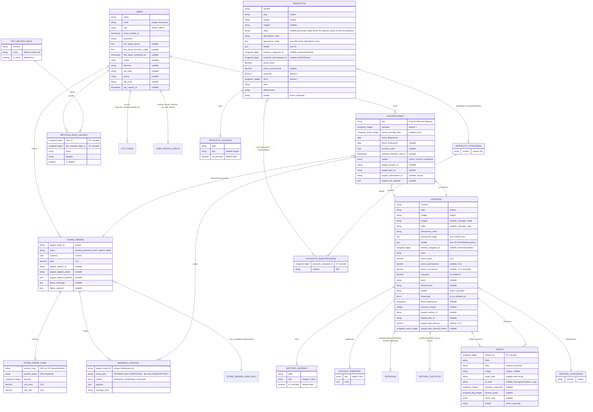

# DIAGRAMA_ENTIDAD_RELACION

> Diagrama Mermaid generado del análisis de migraciones y modelos.
> Refleja el estado del esquema en la rama actual.

## Diagrama ERD (Mermaid)

## Descripción de cada entidad y su rol

| Entidad (modelo) | Tabla | Rol de negocio |
|------------------|-------|----------------|
| **User** | `users` | Usuarios con rol `cliente` o `admin`. Soporta 2FA TOTP, OTP para verificación de email y reset de password (almacenado en `users.otp_code` y `users.otp_expires_at`). |
| **Historia** | `historias` | Producto narrativo central. Tiene galería multimedia, variantes (papel/color), capítulos opcionales y modelo de suscripción mensual PayPal. Asocia `paypal_product_id` y `paypal_plan_id` cacheados. |
| **Producto** | `productos` | Producto físico de catálogo (papelería, coleccionables, regalos). Control de stock, precio base/promoción, galería, IVA. |
| **Suscripcion** | `suscripciones` | Relación `user × historia` con periodicidad (mensual), arco de meses de entrega, fechas, estado (`activa|inactiva|pendiente`), y metadata PayPal (`paypal_subscription_id`, último payload). |
| **StoreOrder / StoreOrderItem** | `store_orders` / `store_order_items` | Pedidos de catálogo (cobro único). Items **denormalizan** slug + nombre para sobrevivir soft delete de Producto. |
| **PasarelaEvento** | `pasarela_eventos` | Auditoría idempotente de eventos PayPal (orders y subscriptions). Único por `paypal_event_id` (excepto eventos internos del sync, que usan `sync-{id}`). |
| **Audio** | `audios` | Audios narrativos públicos vinculados a una historia. Slug es la route key. Archivos en disco `local`; QR generado en disco `public`. |
| **HistoriaCategoria / HistoriaGaleria / HistoriaVariante / Entrega / HistoriaCapitulo** | `historia_*` / `entregas` | Anatomía modular de la historia. `Entrega` y `HistoriaCapitulo` tienen modelos pero no se usan activamente en CRUD público. |
| **ProductoCategoria / ProductoSubcategoria / ProductoGaleria** | `producto_*` | Taxonomía N:M efectiva (categoría → subcategoría → producto) más galería. |
| **TipoMetodoPago / MetodoPagoUsuario** | `tipos_pago` / `metodos_pago_usuario` | Métodos de pago del usuario (PayPal actualmente). Whitelist configurable en `config/payments.php:allowed_profile_method_type_names`. |

## Cardinalidades críticas

- **Historia ↔ Suscripción**: 1↔N. Una historia admite múltiples suscriptores.
- **Usuario ↔ Suscripción**: 1↔N. Un usuario puede tener varias suscripciones a distintas historias.
- **Usuario ↔ Historia activa**: pre-check impide duplicar `Suscripcion` con `estado='activa'` por usuario×historia (`PayPalSubscriptionCheckoutController@draft:42`).
- **StoreOrder ↔ StoreOrderItem**: 1↔N (cascadeOnDelete).
- **StoreOrder ↔ PasarelaEvento**: 1↔N (nullOnDelete).
- **StoreOrder ↔ Suscripcion**: relación opcional vía `suscripciones.store_order_id` (cascade pending) que identifica la orden de catálogo que disparó la suscripción.
- **ProductoCategoria ↔ Producto**: restrictOnDelete (no se puede borrar categoría con productos asociados).

## Restricciones notables

- **Soft Deletes:** `historias`, `productos`, `audios` usan `SoftDeletes`.
- **Unique clave natural:** `historias.slug`, `historias.codigo`, `productos.slug`, `productos.codigo`, `audios.slug`, `audios.codigo`, `historia_categorias.nombre`, `producto_categorias.nombre`, `[producto_categorias_id, nombre]` único compuesto, `pasarela_eventos.paypal_event_id`, `users.email`.
- **Índices:** `historias(estado, destacada, fecha_publicacion)`, `productos(estado)`, `suscripciones(estado, fecha_adquisicion)`, `pasarela_eventos(event_type, estado)`.
- **Enumeraciones:** `users.role` = `cliente|admin`; `historias.estado` y `productos.estado` = `activo|pausado`; `historias.destacada` = `si|no`.
- **Defaults importantes:** `users.role` default `cliente`; `users.otp_expires_at` 10 min (en `User::generateOtp()`).
